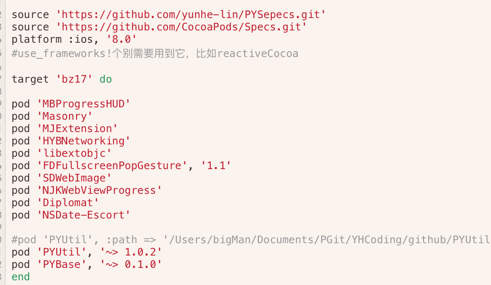

##PYDescription
如何维护自身的pod库（仿造cocoapods）

<ol>
<li>cocoaPods</li>
<li>添加pod</li>
<li>cocoaPods 实现管理pod 原理</li>
<li>搭建自己项目的cocoaPod管理平台</li>
<ol>
#--
>cocoaPods

>>开发 iOS 项目不可避免地要使用第三方开源库，CocoaPods 的出现使得我们可以节省设置和更新第三方开源库的时间。这个就不多做解释了。

>添加pod

>>简略的说：
 
需要一个合法经过校验的源代码pod库, 创建pod库 "PYUtil" ，修改PYUTil.podSpec文件，校验PYUTil，通过后就能上传到自己的远端代码仓库中。然后修改podfile中添加你的 pod 'podName', :git => 'url' 类似与这样的形式.
[学习如何生成pod库模板](http://www.cnblogs.com/brycezhang/p/4117180.html)(带上如何静态库连接，学习后会带上静态库的pod管理).

>>如果只是想简单引入自身维护的单个pod库的话，那么到这里你已经可以结束了。
>>
>>简单阐述一下为什么需要维护自身项目的pod的管理平台。大致上pod维护分为两种，一种基础公共的pod库和业务pod库。维护pod管理平台的好处最大的得意者是业务库。一次版本的迭代跨越一个大版本。例如从0.1.0 -> 0.2.0，开发过程中小版本的跨越。如此一来以往版本的bug只需切换分支就显而易见。
>
cocoaPods 实现管理pod 原理

>>
>>
>>红色框内 两个元素，podName ， version (~> >= 这两个符号不同),
那么如何根据这两个元素来确定正确的pod库呢 。

>>首先我们来看一下cocoaPod自身维护的Spec库。clone 'https://github.com/CocoaPods/Specs.git'

pod管理是cocoaPod出的，那么pod库的默认选中路径就是上述的git连接,根据podName 去对应的目录下找到名字匹配的pod文件夹，这个文件夹下对应版本的文件夹。例如1.3.5这个文件夹，里面存放的就是一个你自己的podspec文件。那么这个podSpec如何找到你想要的代码呢。

s.source 这个配置 对应的是 git 和 tag 两个参数，这里tag与版本号设置的相同，所以会根据打了tag的分支作为这个版本的代码。所以你只要在cocoaPod上传你自己这样的文件配置和对应有的git仓库，那么这个时候cocoapod也就帮你维护了 。（维护还是要自己维护，cocoaPod的管理人员只是有校验的功夫）

> 建立属于自己的Spec仓库
>> 在代码仓库中拉出新的仓库，作为维护自己的spec的仓库.模仿cocoaPod的维护方式，上传自己对应podname的库，tag等等 。
>> 这样你的仓库推送上去你就有自己对应的pod管理平台了，可是如何让你的项目知道你的pod不是在cocoapod维护的那个仓库呢。需要修改项目的podfile文件，告诉cocoaPod 还有另外的source地址。
>> 
>> 这样cocoaPod就会去这两个人地址去寻找对应的pod库.
>> 维护自己的就是不想每次都要让cocoaPod的维护人员去合，这个过程比较漫长，而且这只是个思路。以后将自己项目的代码维护到私有的代码仓库中，就必须要自己维护。
##大概就是这样了 ， 庄兄晓得了么 。