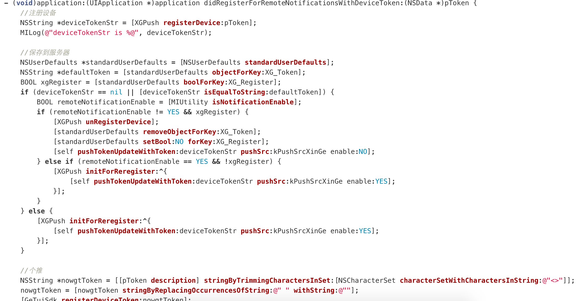

#### 如何减少一个庞大臃肿的AppDelegate文件
为什么AppDelegate会变得如此臃肿。
<ol>
<li>设备与应用程序交流的唯一入口，各种业务逻辑代码耦合在此</li>
<li>应用程序的加载入口，各种启动加载配置统一会在这里面处理</li>
</ol>

<h5>
惯性思维AppDelegate就像一个中转站，我启动的时候需要初始化分享的sdk，添加分享sdk代码，我需要支付sdk初始化，我需要注册通知，注册通知的代码。接收到本地通知，远程通知的处理代码..等等。因此AppDelegate绝对不是一口吃成一个胖子的。

展示代码：
启动：267行代码

推送逻辑代码：400+行

当一个新人员工，需要熟悉自己所在业务线需要的启动服务，推送逻辑代码，要在一个1000多行的浩瀚代码中熟悉业务逻辑代码是否很难 ？

<h4>那么如何对一个庞大的AppDelegate文件进行瘦身呢？

<h6>个人理解 AppDelegate 现在扮演的不单单是一个发送action的角色，更加扮演了管理者的身份。需要对业务代码，配置代码进行管理，全部冗余在了自身文件中。瘦身的第一步明确AppDelegate的作用，AppDelegate只是一个消息分发的中心，也类似于服务中心。不在处理任何逻辑代码只是做消息传递，需要接收到消息的对象必须注册AppDelegate服务。

注册的服务是整个AppDelegate的生命周期--UIApplicationDelegate这里的所有方法。

UIApplication->AppDelegate->ServiceModules(注册各种服务模块)

只是一个思想，只有融入APP中，才能有更好的例子。

